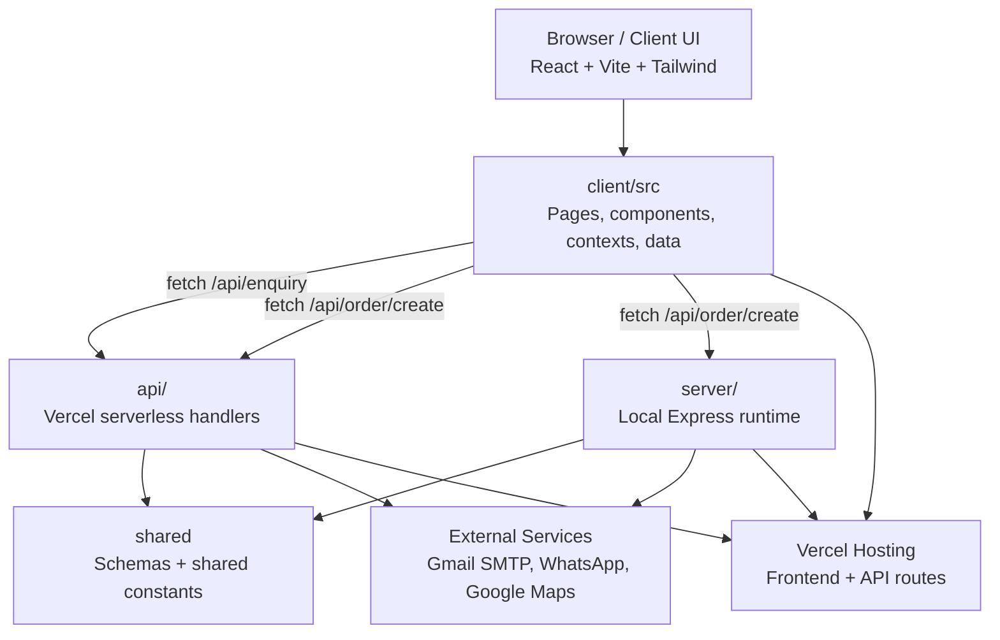

# Desert Blooms Website — Project Structure Guide

This document explains how the project is organized, what technologies it uses, how the runtime works, and what to watch out for when hosting it on Vercel.

It is written so that a Copilot or another AI assistant can understand the codebase quickly and make safe changes.

---

## 1. Project Summary

This is a Vite + React + TypeScript frontend for a landscaping and agricultural tools business in Kuwait, with:

- a marketing/home page
- a tools catalog page
- a cart and checkout flow
- enquiry form submission
- order receipt generation
- WhatsApp order receipt flow
- local development server support
- Vercel serverless API support

The app is structured as a hybrid project:

- Frontend lives under `client/src`
- Shared validation and business rules live under `shared`
- API logic is split between `server` (local Express usage) and `api` (Vercel serverless handlers)
- Build output is generated into `dist`

---

## 2. High-Level Architecture



### Runtime interpretation

- Local development is powered by Vite dev server from `vite.config.ts`
- The Vite server injects custom middleware for:
  - `/api/enquiry`
  - `/api/order/create`
  - `/manus-storage`
  - `/__manus__/logs`
- On Vercel, the app does not use `server/index.ts` directly. Instead, the `api/` folder provides the production serverless endpoints.

---

## 3. Tech Stack

### Frontend

- React 19
- TypeScript
- Vite 7
- Wouter for routing
- Tailwind CSS v4
- Framer Motion for UI interactions
- Radix UI primitives for dialogs, drawers, dropdowns, etc.
- Lucide React for icons
- React Hook Form + Zod for forms
- Recharts for charts
- Sonner for toast notifications
- jsPDF for receipt PDF generation

### Backend / Server

- Express 4
- Node.js runtime
- `nodemailer` for SMTP mail delivery
- `zod` for request validation
- `express-rate-limit` for local API rate limiting
- `dotenv` for environment variables

### Build / Tooling

- TypeScript
- Vite plugins
- esbuild for server bundle generation
- pnpm as package manager
- Prettier
- Vitest is installed, but not clearly used in visible tests yet

### External integrations

- Gmail SMTP for enquiry emails
- WhatsApp links for order receipts
- Google Maps frontend script integration in `client/src/components/Map.tsx`
- `client/src/const.ts` includes OAuth-related code, but this feature is not clearly wired into the current visible app flow

---

## 4. How the Project Is Arranged

### Root files

- `package.json` — scripts, dependencies, package manager, Vite build configuration
- `pnpm-lock.yaml` — lockfile for pnpm
- `tsconfig.json` — TypeScript config
- `vite.config.ts` — main Vite configuration and local dev API plugins
- `vercel.json` — Vercel deployment config
- `components.json` — design-system component mapping (shadcn-style)
- `ideas.md`, `todo.md` — project notes and planning docs

### Main folders

```text
.
├── api/
│   ├── enquiry.ts
│   └── order/
│       └── create.ts
├── client/
│   ├── public/
│   └── src/
│       ├── components/
│       ├── contexts/
│       ├── data/
│       ├── hooks/
│       ├── lib/
│       ├── pages/
│       ├── types/
│       ├── App.tsx
│       ├── const.ts
│       ├── contact.ts
│       ├── index.css
│       └── main.tsx
├── server/
│   ├── devRateLimit.ts
│   ├── index.ts
│   ├── mail.ts
│   ├── processEnquiry.ts
│   ├── processOrder.ts
│   └── serverRateLimit.ts
├── shared/
│   ├── const.ts
│   ├── enquirySchema.ts
│   ├── orderSchema.ts
│   └── tools.json
├── dist/
├── patches/
├── extracted_cards/
├── extracted_tools_images/
└── public/
```

---

## 5. Why the Main Folders Exist

### `client/`

This is the user-facing web application.

- `client/src/App.tsx` sets up routing and providers
- `client/src/pages/Home.tsx` contains the primary landing page
- `client/src/pages/ToolsPage.tsx` contains the shop/catalog page
- `client/src/components/` contains reusable UI and storefront components
- `client/src/contexts/` holds state like cart and theme
- `client/src/data/tools.ts` contains the catalog data used by the storefront
- `client/src/contact.ts` contains public contact metadata and WhatsApp settings

### `shared/`

This folder contains cross-cutting logic that both frontend and backend consume.

- `shared/enquirySchema.ts` defines enquiry validation and allowed services
- `shared/orderSchema.ts` defines order payload validation
- `shared/tools.json` contains canonical tool metadata used for order verification
- `shared/const.ts` contains shared constants

This is important because the order validation process compares incoming order items against `shared/tools.json` to make sure the requested tools exist and to calculate verified totals.

### `server/`

This folder contains the local server-side runtime used during development and local production-style runs.

- `server/index.ts` starts an Express app and exposes routes
- `server/processEnquiry.ts` validates and sends enquiries
- `server/processOrder.ts` verifies cart items against the tools catalog and builds the WhatsApp receipt
- `server/mail.ts` defines SMTP mail sending
- `server/devRateLimit.ts` and `server/serverRateLimit.ts` implement in-memory rate limiting

### `api/`

This folder is the Vercel-specific deployment surface.

- `api/enquiry.ts` handles enquiry requests on Vercel
- `api/order/create.ts` handles order requests on Vercel

These functions are effectively the production version of the local server API endpoints.

---

## 6. API Flow and Request Handling

### Enquiry flow

1. Browser submits form data from `client/src/pages/Home.tsx`
2. Client calls `POST /api/enquiry`
3. Server validates body using `shared/enquirySchema.ts`
4. A honeypot field ` _gotcha ` is checked and rejected if filled
5. SMTP email is sent via `server/mail.ts`
6. Response is returned to the browser

### Order flow

1. Browser adds tools to cart in `client/src/contexts/CartContext.tsx`
2. Client calls `POST /api/order/create`
3. Server validates order payload with `shared/orderSchema.ts`
4. Items are matched against `shared/tools.json`
5. Verified item list and total are constructed
6. A WhatsApp URL is generated with the formatted receipt message
7. Browser receives receipt JSON and opens the receipt modal

### Validation strategy

The app avoids trusting the frontend alone.

- client-side validation is present, but not sufficient
- server-side validation is the real source of truth
- order items are matched against a canonical catalog and not just accepted by raw ID

This is a strong design choice and helps avoid fake or manipulated order requests.

---

## 7. Frontend Structure, Page-by-Page

### `client/src/App.tsx`

Main app shell.

Responsibilities:

- sets up `ErrorBoundary`
- sets up `ThemeProvider`
- sets up `CartProvider`
- sets up `TooltipProvider`
- sets up `Toaster`
- wires routes using Wouter

### `client/src/pages/Home.tsx`

Landing page with:

- hero banner
- services section
- featured tools section
- projects section
- contact form
- cart drawer and receipt modal integration
- WhatsApp floating action button

### `client/src/pages/ToolsPage.tsx`

Tools catalog page with:

- search bar
- category filters
- sorting
- product grid
- cart summary button

### `client/src/components/`

Contains reusable UI pieces.

Examples:

- `ToolCard.tsx` — card for each tool
- `CartDrawer.tsx` — shopping cart UI
- `ReceiptModal.tsx` — order receipt modal
- `Map.tsx` — Google Maps frontend integration
- UI primitives under `components/ui/` are generated/borrowed Radix/Tailwind-style components

### `client/src/contexts/`

- `CartContext.tsx` manages cart state
- `ThemeContext.tsx` manages light/dark theme state

---

## 8. Data and Shared Logic

### `shared/tools.json`

This file is the main catalog source of truth.

It stores:

- tool IDs
- bin numbers
- names
- categories
- pricing
- image metadata

This file is used in the order verification process to prevent invalid or tampered item entries.

### `shared/orderSchema.ts`

Defines:

- order item requirements
- customer fields
- phone number validation
- delivery notes validation
- honeypot field guard

### `shared/enquirySchema.ts`

Defines enquiry validation:

- name/email/service/message requirements
- service options
- honeypot field protection

---

## 9. What the App Does in Practice

The project is not just a marketing website. It contains a useful storefront flow:

- browse tools
- add items to cart
- validate order payload on the server
- verify every item against a canonical catalog
- generate a receipt in KWD
- generate a WhatsApp message with the receipt
- send the customer to WhatsApp for confirmation

This means the order system is more like a lightweight verified catalog/order workflow than a typical e-commerce checkout.

---

## 10. Local Development and Build Commands

From `package.json`:

```json
"scripts": {
  "dev": "vite --host",
  "build": "vite build && esbuild server/index.ts --platform=node --packages=external --bundle --format=esm --outdir=dist",
  "start": "NODE_ENV=production node dist/index.js",
  "preview": "vite preview --host",
  "check": "tsc --noEmit",
  "format": "prettier --write ."
}
```

### Typical local workflow

```bash
pnpm install
pnpm run dev
```

### Production-style local run

```bash
pnpm run build
pnpm run start
```

### Type check

```bash
pnpm run check
```

---

## 11. Vercel Hosting and Deployment Details

### Current deployment configuration

`vercel.json` contains:

```json
{
  "buildCommand": "npm run build",
  "installCommand": "pnpm install --frozen-lockfile",
  "outputDirectory": "dist/public",
  "framework": "vite",
  "rewrites": [
    {
      "source": "/((?!api(?:/|$)).*)",
      "destination": "/index.html"
    }
  ]
}
```

### What this means

- Vercel is configured to serve the built frontend from `dist/public`
- SPA routes are rewritten back to `index.html`
- API routes under `api/` are expected to work as serverless functions
- The Vite build output is also generating a Node server bundle in `dist/index.js`, but that is primarily for local production-style serving, not Vercel’s serverless runtime

---

## 12. Vercel-Specific Caveats / Potential Loopholes

These are the main things to be aware of when this project is hosted on Vercel.

### 1. Local Express server and Vercel are not the same runtime

The project has two separate server implementations:

- `server/index.ts` for local Express hosting
- `api/enquiry.ts` and `api/order/create.ts` for Vercel serverless functions

This is a key architectural split. If you update the logic in `server/processEnquiry.ts` or `server/processOrder.ts`, you must make sure the Vercel API handlers are still aligned with that behavior.

### 2. In-memory rate limiting will not be reliable on Vercel serverless

Both `server/devRateLimit.ts` and `server/serverRateLimit.ts` use in-memory `Map` storage.

On Vercel:

- function instances may be reused or restarted unpredictably
- rate-limit buckets will not be shared across invocations reliably
- per-instance memory is not a durable or globally shared store

This means the rate limiting is reasonable for local dev, but it is not a production-grade distributed limiter.

Recommended improvement:

- move rate limiting state into Redis, Upstash, or another persistent/store-backed service

### 3. The app uses environment variables extensively

The code relies on environment variables such as:

- `GMAIL_USER`
- `GMAIL_APP_PASSWORD`
- `ENQUIRY_TO_EMAIL`
- `VITE_CONTACT_PHONE`
- `VITE_CONTACT_PHONE_TEL`
- `VITE_CONTACT_WHATSAPP`
- `VITE_CONTACT_EMAIL`
- `BUILT_IN_FORGE_API_URL`
- `BUILT_IN_FORGE_API_KEY`

If these are missing in Vercel, parts of the app may silently fail or behave incorrectly.

### 4. `server/index.ts` is not the production execution path on Vercel

Even though `npm run build` produces `dist/index.js`, that file is not what Vercel uses to serve the app by default.

The production API route that matters on Vercel is the `api/` directory.

So any logic that is only implemented in the local server may be ignored in production unless duplicated or intentionally mirrored.

### 5. SPA rewrites can mask route issues

`vercel.json` rewrites all non-API routes to `index.html`.

This enables SPA routing, but it also means:

- missing pages may appear to work as front-end routes
- route-level errors may be hidden behind client-side handling
- misconfigured backend paths can be harder to debug visually

### 6. `client/src/const.ts` looks unfinished or unused

This file contains OAuth-related code and a runtime login URL generator, but the visible current frontend does not appear to rely on it strongly.

Possible explanations:

- unfinished feature left in the repo
- future integration not yet completed
- code kept for future use

This should be reviewed before adding new auth or callback flows.

### 7. The Vite dev API middleware is local-only

`vite.config.ts` injects middleware for `/api/enquiry`, `/api/order/create`, `/manus-storage`, and `/__manus__/logs`.

These endpoints exist in local development only. They are not automatically deployed as Vercel serverless functions unless the same behavior is mirrored in `api/`.

### 8. The app currently relies on hard-coded business configuration

The target WhatsApp number is hardcoded in `server/processOrder.ts`:

- `TARGET_WHATSAPP_NUMBER = "96560096148"`

This is fine for a simple setup, but it should be moved to environment variables for better maintainability and safer configuration management.

---

## 13. Recommended Improvements for Production Hardening

If you want this project to be more robust on Vercel, the following changes would help:

1. Move WhatsApp target number into environment variables
2. Move all SMTP config into environment variables and validate them explicitly
3. Replace in-memory rate limiting with Redis or Upstash
4. Make the local Express layer and Vercel API layer share a single core implementation if possible
5. Review `client/src/const.ts` to determine whether OAuth code should be removed or completed
6. Add a proper production logging and monitoring strategy
7. Add tests for the mail/order flows and schema validation
8. Consider separating API logic from frontend logic further for easier maintenance

---

## 14. Practical Notes for Copilot / AI Agents

When going into this repo, key files to read first are:

- `package.json`
- `vite.config.ts`
- `vercel.json`
- `client/src/App.tsx`
- `client/src/pages/Home.tsx`
- `client/src/pages/ToolsPage.tsx`
- `server/processOrder.ts`
- `server/processEnquiry.ts`
- `server/mail.ts`
- `api/enquiry.ts`
- `api/order/create.ts`
- `shared/tools.json`
- `shared/enquirySchema.ts`
- `shared/orderSchema.ts`

If you are changing behavior, always check both the local runtime path and the Vercel runtime path, because the project uses both.

---

## 15. Final Takeaway

This project is a hybrid Vite + React + TypeScript application with a frontend storefront, a validated server-side order system, email sending, and Vercel deployment support.

The main architectural caveat is that the repo contains both:

- a local Express/server setup, and
- a Vercel serverless API setup

So the safest way to maintain it is to treat the `api/` handlers as the production path and keep them synchronized with the local server logic.

---

## 16. Optional Next Step

If you want, I can also turn this into:

- a shorter Copilot-ready summary prompt,
- a more formal architecture document for clients,
- or a deployment checklist specifically for Vercel setup and environment variables.
